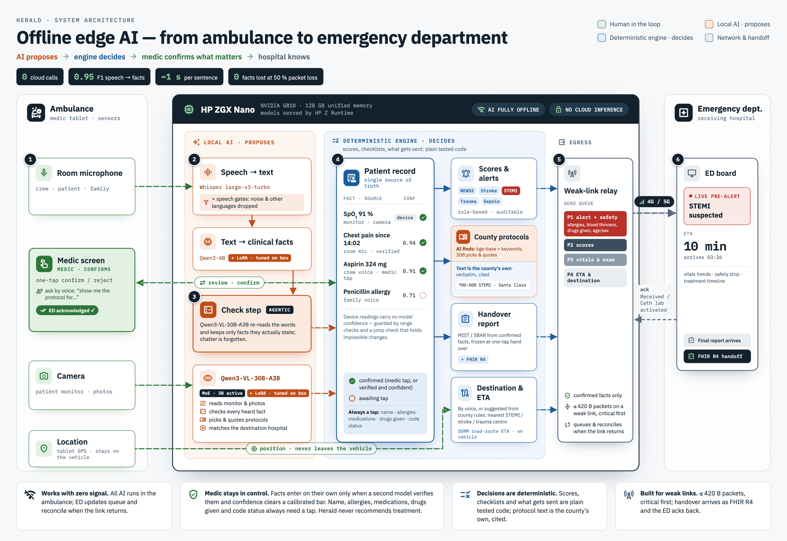

# Herald

**The patient's story arrives before the doors open.**

Herald is an AI copilot for the back of the ambulance. It listens to the crew, the patient and the family, reads the
patient monitor through a camera, keeps a checked patient record while the paramedic works, pre-alerts the emergency
department over a weak link, and hands the patient over in one tap. **Every model runs on one HP ZGX Nano in the
vehicle. Zero cloud AI calls.**

Team LastMinute · HP Edge AI SJSU Hackathon, September 2026 · Jenil Savalia · Tushar Singh · Vineet Malewar ·
Shivani Jariwala · Rajeev Ranjan Chaurasia

**[Demo video](https://youtu.be/3mkeTmvGR2M) · [Pitch deck](https://bundled-page-roan-one.vercel.app/#1) · [Landing page](https://herald-ems-one.vercel.app/)**



## The problem

A paramedic treats, remembers and reports at the same time.

- **During the call, minutes matter.** An untreated stroke costs 1.9 million neurons a minute (Saver, *Stroke* 2006);
  each 30-minute delay in a heart attack raises 1-year mortality by 7.5% (De Luca et al., *Circulation* 2004).
- **After the call, the report comes late.** Hospitals received only about half of EMS patient reports, and 26.3% of
  those within 2 hours (155,423 transports; Shanley et al., *Prehospital Emergency Care* 2025).
- **At the door, the handover is spoken and incomplete.** 97.6% of handovers were verbal only; allergies were missing
  in 55.4%, and the EMS record was available in 7.2% (Braverman et al., *International Emergency Nursing* 2026).
  When the ED saw live prehospital data before arrival, team readiness rose from 7.1 to 12.8 out of 15 (Bleeg et al.,
  *Journal of Emergency Medicine* 2026).
- **And the network drops exactly when it is needed:** rural roads, basements, disasters.

## What Herald does

| | |
|---|---|
| **Listens hands-free** | One room microphone hears the crew, the patient and the family. Speech gates drop noise and other languages; small talk is forgotten. |
| **Speech → facts** | Whisper large-v3-turbo transcribes (a 10 s clip in about 0.3 s); a **Qwen3-4B we fine-tuned on this box** turns the words into typed facts (vitals, medications, allergies, onset, stroke and STEMI findings, treatments) in about 1 s. |
| **Checks every fact (agentic)** | A second model, **Qwen3-VL-30B-A3B fine-tuned on this box**, re-reads the words and keeps only facts they actually state. A fact enters the record on its own only when the check kept it and the model's confidence clears a calibrated bar. **Name, allergies, medications, drugs given and code status always wait for one tap.** |
| **Reads the monitor** | The camera reads HR, BP, SpO2, RR and EtCO2 about every 15 s straight into live trends; a reading that jumps implausibly is held for the medic. |
| **Copilot on every call** | County alert checklists (stroke, STEMI, trauma, sepsis) show what is still missing; published scores (NEWS2, RACE, G.F.A.S.T., field triage) are computed by plain code; clocks and reassessment reminders run. |
| **Protocols on voice** | "Show me the protocol for STEMI" returns Santa Clara County's own passage, quoted and cited (document, section, page, date). |
| **Destination and ETA** | Set by voice, or suggested from the county's rules (nearest STEMI, stroke or trauma centre) with a road-route ETA computed on the vehicle (OSRM). |
| **Weak-link pre-alert** | Only confirmed facts leave the vehicle: most critical first, 420-byte packets on a weak link, queued and reconciled when the link returns. The ED board replies ("Received", "Cath lab activated"). |
| **One-tap handover** | A spoken MIST / SBAR report from confirmed facts, frozen and sent at hand over, with a FHIR R4 export; the next patient starts clean. |
| **The medic decides** | Herald never recommends treatment. Scores, checklists and what gets sent are plain, tested code; protocol text is the county's own. |

## Metrics: what we measured, how, and why

Every number below was measured on the HP ZGX Nano, on data the models never saw during training, and each is
repeated 3 times unless stated. The scripts are in `eval/` and write their results to `eval/results.jsonl`.

### The test data

- **Speech to facts:** a held-out gold set of 100 EMS utterances with 320 facts (`eval/gold_v2.jsonl`), plus a
  100-utterance every-call set covering drugs given, procedures, GCS, EtCO2, trauma and 12-lead findings. Each set
  was written and labeled by two independent annotators who never saw the extractors or the training data; they
  agreed at F1 0.979 before adjudication (`eval/agreement.py`).
- **Protocols:** Santa Clara County's 32 current EMS documents, with an answer key built by CPU tools only, and 52
  in-scope plus 7 out-of-scope questions.
- **Relay:** a fixed, confirmed stroke record sent through the real relay, so the result measures the link and not
  the model.

### Results

| Metric | What it measures | How we measured it | Result | Why we chose it |
|---|---|---|---|---|
| **F1, speech to facts** | How many facts are right, counting both wrong and missed facts | Gold v2 text through the served extractor; each fact scored as (key, normalized value), list items one by one (`eval/bench_extract.py`) | **0.950** fine-tuned Qwen3-4B vs **0.661** prompted 30B model (Nemotron-3-Nano-Omni) | A wrong fact and a missed fact both hurt a patient; F1 penalises both |
| **Precision / recall** | Share of recorded facts that are correct / share of said facts that are recorded | Same run | **0.96 / 0.94** | Shows the balance: few invented facts, few missed ones |
| **Who said it** | Whether each correct fact is credited to the right person (medic, patient, family) | Role accuracy on matched facts, same run | **0.97** | A family member's words are not the medic's finding |
| **Who said it, room microphone** | Whose information each fact is when one microphone hears everyone, from the words alone | The check step (Qwen3-VL-30B-A3B) gets each utterance and its facts with no hint of who spoke; gold v1 and v2 (589 facts) and our own room-mic runs (101 facts), 3 runs (`eval/bench_speaker.py`) | **92.9%** credited to the right person, 1.8% left unidentified; someone else's words read as the medic's: **5 to 7 of 166**; **0** false patient names on the 200 gold utterances | Hands-free means one microphone for everyone; the handoff has to say who told us what |
| **Latency** | Time from words to facts | Per-utterance wall time on the box, p50 / p95, FP8 serving | **1.1 to 1.5 s / 2.4 to 3.1 s**; Whisper transcribes a 10 s clip in about 0.3 s | The medic works live; the record must keep up with speech |
| **Self-confirmed accuracy** | Of the medic's facts that entered the record without a tap, how many were right | Confidence threshold 0.8 calibrated on a dev set, applied to the held-out set (`eval/calibrate_confidence.py`) | **99.4%** (160 of 161 correct) | These facts skip the medic's check, so they need the strictest bar |
| **Every call type** | Drugs given, procedures, GCS, EtCO2, trauma and 12-lead findings | Every-call set, same scoring | **F1 0.84** | Herald has to work on every call, not only stroke |
| **Drug names** | Brands, misspellings and combinations mapped to RxNorm on the box | Same predictions scored with and without coding, 42 saved runs | Precision **0.933 to 0.956**, nothing lost | A drug recorded under the wrong name is a safety risk |
| **Relay under packet loss** | Whether confirmed facts arrive exactly once when half the sends fail | 20 seeds, 50% of sends failing, 420-byte packets (`tests/test_relay.py`) | **0 lost, 0 duplicates** | Ambulances lose signal; nothing may be lost or sent twice |
| **Relay on a weak link** | Speed of the first critical update over a throttled real link | Real HTTP through the link emulator at 1 KB/s and 800 ms latency, 3 runs (`eval/bench_relay.py`, `docs/RELAY_BENCHMARK.md`) | First critical packet **409 B**, acknowledged in **1.43 s**; 13% of the full record | The ED needs the critical facts first, even on one bar |
| **Protocol recovery** | Whether every numbered section of the county documents is found, and nothing invented | Against the CPU-built answer key (`eval/bench_protocols.py`) | **1,746 of 1,746** sections, none spurious; Table B's 168 cells exact | A quoted rule is only useful if it is the county's exact text |
| **Protocol retrieval** | Whether the right passage comes first for a question | 52 questions; keyword and embedding search, then the local model reranks | Right passage first **41 of 52**, top 3 **43 of 52**; 4 of 7 out-of-scope questions refused | The medic asks by voice and reads one answer |
| **Cloud calls** | Whether anything calls a cloud AI service | Every outbound request passes one egress policy that logs and counts it (`GET /api/egress`) | **0** | Privacy, and working with no signal |

### Live runs: real voices, real camera

The table above uses held-out text. We also measured Herald end to end on our own demo runs (September 26, 2026):
team members speaking the demo call aloud in a room, one laptop microphone, the camera pointed at the monitor
simulator, everything running on the ZGX Nano. We labeled each clip by hand against what was actually said.

| Metric | How we measured it | Result |
|---|---|---|
| **Facts from real speech** | 36 scripted clips through microphone, Whisper, the extractor and the check step; each fact labeled correct, wrong or missed | **93 correct, 5 wrong, 13 missed**: precision **0.95**, recall **0.88**, F1 **0.91** |
| **Speech to text time** | Whisper time per clip (median clip 7.5 s) | **0.53 s** median, 1.25 s p95 |
| **Speech to facts time** | Whisper plus extraction plus the check step, per clip | **3.0 s** median, 8.8 s p95 |
| **Talk that was not part of the call** | 7 clips of people talking nearby | 9 facts proposed; **8 of 9 held for the medic's tap** |
| **Monitor reading by camera** | 191 camera reads of the simulator; each value compared with the frames the simulator displayed | **934 of 935 values correct (99.9%)**; 190 of 191 reads exactly right; EtCO2 read in 180 |
| **Patient name** | The name said aloud in our room-mic runs, read by the check step | **3 of 3** found across our 43 distinct room-mic clips, **0** false names, in all 3 runs (`eval/live_names_v1.jsonl`; one clip whose name the speech-to-text step garbled is not scored) |

About half of the missed facts came from fast, run-together speech that the speech-to-text step misheard (for
example "one oh four over sixty" heard as "10460"). Speaking one sentence at a time avoids most of them.

### How to reproduce

```bash
python eval/bench_extract.py --extractor llm --model ems-e-v2-fp8 --gold eval/gold_v2.jsonl   # F1, roles, latency
python eval/calibrate_confidence.py                                                          # self-confirmed accuracy
python eval/bench_protocols.py                                                               # protocol recovery and retrieval
python -m pytest -q tests/test_relay.py                                                      # relay at 50% loss
python eval/bench_relay.py --runs 3                                                          # weak-link relay (see docs/RELAY_BENCHMARK.md)
```

The results table is measured on held-out text; the live runs above measure the whole path from the microphone.
The full method and every run are in [`docs/MODEL_PLAN.md`](docs/MODEL_PLAN.md).

## Demo and links

| Public | Address |
|---|---|
| Demo video | https://youtu.be/3mkeTmvGR2M |
| Pitch deck | https://bundled-page-roan-one.vercel.app/#1 |
| Landing page and the recorded stroke call | https://herald-ems-one.vercel.app/ |

The live product runs on the HP ZGX Nano with local AI. Start it with `scripts/herald.sh` (see [Run it](#run-it)), then:

| Page | Address |
|---|---|
| Landing page | `http://localhost:8100` |
| Medic app ("Open Herald" starts a fresh case) | `http://localhost:8100/app/` |
| Recorded call, plays by itself | `http://localhost:8100/app/?fixture=stroke_demo` |
| ED board | `http://localhost:8200` |
| Monitor simulator | `http://localhost:8100/monitor.html` |

## Architecture

Models turn speech, camera frames and documents into facts or passages. Everything that decides is plain, tested
code: the patient record, scores, checklists, what counts as confirmed and what gets sent. Clinical tables, county
rules and prompts live in `config/` as reviewed data with their sources.

| Path | What |
|---|---|
| `herald/extraction/` | Speech to facts: the fine-tuned extractor, confidence, grounding, the check step |
| `herald/capture/` | Camera: monitor watch, frame selection, device readings and the jump check |
| `herald/core/` | Fact model, vocabulary, patient record, confirmation policy |
| `herald/scoring/`, `herald/checklists/` | NEWS2, RACE, G.F.A.S.T., field triage; county alert checklists |
| `herald/knowledge/` | County protocol search, quoting and citation |
| `herald/transport/` | Destination from county rules, road-route ETA (local OSRM) |
| `herald/relay/`, `herald/egress/` | Weak-link relay to the ED; the single policy point for anything leaving the box |
| `herald/reporting/` | MIST / SBAR handover report, FHIR R4 export |
| `herald/api/` | FastAPI app and WebSocket hub |
| `ui/` | Landing page, medic app, monitor simulator (React, TypeScript) |
| `ed_receiver/` | The emergency department board |
| `eval/` | Gold sets, benchmarks, adversarial sets, protocol answer keys |

## Run it

On the HP ZGX Nano (aarch64, GB10, CUDA 13), from a checkout of `main`:

```bash
scripts/setup.sh          # first time: checks the platform, installs requirements
scripts/herald.sh up      # starts everything and waits until speech, extraction and vision are ready
```

`herald.sh up` serves the two fine-tuned models on HP Z Runtime (:8080), builds the UI, and starts the ED board
(:8200), the link emulator (:9000), the road router (:5100) and the app (:8100). `herald.sh status`, `logs` and
`down` do the rest. A container build is also available: `docker compose up --build herald`.

Browsers allow the microphone and camera only on `localhost` or HTTPS, so forward the ports from a laptop:

```bash
ssh -N -L 8100:localhost:8100 -L 8200:localhost:8200 <user>@<nano>
```

Then open `http://localhost:8100` and click **Open Herald**. The ED board is `http://localhost:8200` and the
monitor simulator is `http://localhost:8100/monitor.html` (point the camera at it).

- Tests: `python -m pytest -q` (backend) and `npx vitest run` in `ui/` (screens).
- Benchmarks: `eval/bench_extract.py`, `eval/adversarial_bench.py`.
- Running the ED board on a second machine: `pip install fastapi "uvicorn[standard]"`, then
  `python -m uvicorn ed_receiver.app:app --port 8200`, and point `HERALD_ED_URL` at it.

## Privacy and the cloud

No code path in Herald can call a cloud AI service: the model client accepts only local addresses, and the app
refuses to start with anything else. The only data that leaves the vehicle is the ED update and the county protocol
sync, and every outbound request passes one allow, queue or deny decision (`herald/egress/`, `config/egress.yaml`),
logged and counted at `GET /api/egress`. Patient audio and photos stay on the vehicle and are deleted when the
encounter ends. The active call is kept in encrypted local storage so a restart does not lose it.

## Sources

- Saver JL. Time is brain, quantified. *Stroke* 2006.
- De Luca G et al. Time delay to treatment and mortality in primary angioplasty. *Circulation* 2004.
- Shanley J et al. EMS patient care report availability after transport. *Prehospital Emergency Care* 2025.
- Braverman A et al. EMS to ED handovers, an observational study. *International Emergency Nursing* 2026.
- Bleeg RC et al. Real-time prehospital data on an ED screen. *Journal of Emergency Medicine* 2026.
- Royal College of Physicians. National Early Warning Score (NEWS2), 2017.
- Pérez de la Ossa N et al. RACE scale. *Stroke* 2014.
- Santa Clara County EMS policies and protocols, including 501, 602, 605, 700-A04, 700-A08 and 700-A13 (2026).
- Newgard CD et al. National Guideline for the Field Triage of Injured Patients, 2021.

Team LastMinute, HP Edge AI SJSU Hackathon, September 2026. Licensed under the terms in `LICENSE`.
