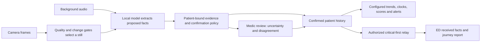

# EMS copilot workflow and review closeout

Updated 2026-09-25. This describes the implemented prototype and its remaining acceptance work, not a clinical-readiness rating.

## Problem and product boundary

The medic is treating the patient while observations, spoken findings, interventions and changing transport conditions accumulate. Re-entering those facts competes with care; a final set of numbers loses the journey that the receiving team needs. Herald's job is to maintain an evidence-backed patient record during that journey, draw attention to meaningful changes or uncertainty, and deliver the confirmed record to the ED.

The broader [EMS AI copilot concept](https://ems-ai.com/ai-copilot.html) describes assistance across clinical and operational work. Herald implements a narrower loop: observe, extract, reconcile, highlight and report. It does not infer treatment effectiveness, establish medication administration from a visible label, or make treatment decisions.

## Component decisions

| Component | Job in this workflow | Implemented behavior |
|---|---|---|
| Ambient microphone | Reduce repeated entry while care continues | Explicit start; bounded clips process in the background. Pause and resume are independent of queued extraction. Ambient proposals retain the existing confirmation holds. |
| Monitor camera | Observe equipment without a photo button for every reading | Camera → Start monitor watch keeps one patient-bound stream alive while navigating care pages. One unacknowledged frame at a time; at most 1 JPEG/s, 1280 px, 1 MiB. Stop, tab hide, patient change and connection loss release capture. |
| Frame selection | Spend inference on useful observations | Existing server sharpness/brightness/change gates, bounded buffer, stable ROI frames, speech priority and single-flight inference. Default monitor interval is 15 s, global automatic ceiling one admission per 10 s, unchanged refresh after 60 s. These are configurable engineering defaults, not a claim of five-second detection latency. |
| Evidence retention | Preserve provenance without continuous video | Frame ID, source and server observation timestamp accompany extracted facts. `privacy.store: none` retains no selected-frame images; `used_only` stores useful redacted evidence under the existing retention policy. Browser watch stores no video. |
| Patient state | Reconcile evidence over time | Append-only facts, source/confidence, contradictions and explicit review. Camera facts remain unconfirmed. Confirmed facts drive deterministic scores, change rules and relay. |
| Medic overview | Answer what changed, what needs attention and where the call is in time | Visible LKW/ETA/reassessment clocks, full routing text, clinical changes and positive stroke screen priority, recent care events, monitor history with baseline/latest readings and pending proposals distinguished. |
| Vital history | Preserve the journey rather than duplicate the physical monitor | Last confirmed reading remains visible while a new reading awaits review. Trends show observations and freshness. Significant confirmed changes are highlighted by configured rules. This is not a live physiological monitor or a substitute for its alarms. |
| Medication/procedure events | Record what was reported and confirmed | Recent events show source and record time; handoff includes confirmed events. Label matching verifies ingredient only. Observation/record time must not be presented as a known administration time when none was supplied. |
| Review queue | Interrupt for actionable uncertainty | Clinical change, positive stroke screens, contradictions, confirmation and missing information are distinct. No preselected contradiction answer. |
| Handoff and relay | Give the receiving team a usable evolving report | Delivered/queued/held counts belong to the active patient. System delivery and clinician acknowledgement remain distinct. Full sync preserves observation timestamps; weak-link critical packets remain compact. |
| ED display | Show what actually reached the receiving system | Units, configured critical band, absolute LKW elapsed time when supplied, visible confirmed vital history and care events. Full-history age is explicitly distinguished from newer critical updates. |
| Capture timeline | Explain decisions without disrupting reading | Incoming entries wait behind an explicit “N new captures” button; existing entries update in place. Changing patient resets the view. |
| Presentation and synthetic monitor | Demonstrate the same workflow | Presentation remains an alternate view. `/monitor.html` is an isolated synthetic equipment display; it never injects patient facts. A camera must observe its changing readings through the normal pipeline. |

## Review closeout

The supplied review was against `90c8c49`. Several fixes were already present in the starting tree. “Present” below means verified in current code; “completed” identifies additional work in this revision. Neither means physical field acceptance.

| Review item | Current result |
|---|---|
| 1. Error boundary | Present around the React app with recovery control. |
| 2. Missing confirmation fact | Present: confirmation actions guard absent facts. |
| 3. ED critical band | Present: LKW, ETA and G.F.A.S.T. are configured critical fields. |
| 4. Ambiguous LKW | Fixture uses 13:04; medic/presentation elapsed clocks present. Completed ED absolute timestamp relay; browser-local clock guessing removed. Older packets explicitly say elapsed not received. |
| 5. Replay handoff unavailable | Present: fixture mode shows expanded snapshot report. |
| 6. Model down visibility | Present: urgent main banner rather than only a small status pill. |
| 7. Micro typography | Existing floor retained; completed replay counter and new workspace text sizes. Browser checks cover computed visible type sizes. |
| 8. Light recording contrast | Present: capture foreground uses its semantic token. |
| 9. Default time axis and routing | Present on overview; completed unclipped clock layout and full-width routing text. |
| 10. Glove targets | Existing 48 px controls retained; completed 64 px confirm action, contradiction spacing, and dialog/sheet close targets. |
| 11. Brand prominence | Present: small logo and incident-aware chrome. Completed larger normal/urgent attention headline. |
| 12. Clock role | Completed shared 32 px monospace clock token and readable clock layout. |
| 13. Positive stroke screen placement | Completed dedicated queue group directly after clinical changes; medium-priority sorting alone had not fixed actual section placement. |
| 14. ED units | Present in metadata and row rendering; new journey rendering also includes units. |
| 15. Resume audio while processing | Present: queued clips do not disable a new listening session. |
| 16. Portrait vitals | Present: two columns in the affected tablet band; retained through stylesheet consolidation. |
| 17. Repeated announcements | Present: deduplicated urgent announcement pattern. |
| 18. Confidence explanation | Present: model confidence shown for otherwise unexplained medic confirmation holds. |
| 19. Default theme | Present: dark default; both themes remain available. |
| Vital category colors | Present; preserved in consolidated styles. |
| Visible listening state | Present: capture ring/border treatment with reduced-motion handling. |
| Privacy choreography | Completed active-patient delivered/queued/held summary on medic handoff, including event holds and actual clinician acknowledgement. |
| Sentence attention headline | Present; completed positive-screen selection order and emphasis. |
| Collapse CSS generations | Completed: `cabin.css` and `medic.css` folded into `workspace.css`; superseded/dead rules removed and workspace selectors removed from camera stylesheet. |
| Small polish batch | Shadow tokens, 220 px PTT and quiet unidentified-patient chip already present. Completed visible overdue freshness and explicit transcript jump. |

## UI package and component cleanup

The lockfile went from 539 dependency entries to 212 (excluding the root package). Retained dependency versions were not upgraded. Removed the unused Nunito font, unified `radix-ui` dependency, `class-variance-authority`, shadcn CLI/configuration/import, and 13 unused or duplicate component modules. Direct Radix dialog, tabs and tooltip dependencies cover the primitives actually used. Dialog/sheet controls now use the existing shared button.

Retained React/DOM, Zustand, Lucide, Inter/JetBrains Mono, the three Radix primitives, `clsx`/`tailwind-merge`, and the build/test stack because current imports use them. Retained `tw-animate-css` for dialog/sheet/tooltip transitions. Retained classic capture, deck and ED entry points because they serve distinct working flows. No chart library, second state store or replacement UI framework was added.

## Verification and remaining acceptance

Software regression checks: 884 Python tests; 128 UI tests; TypeScript and production build pass. The new integration test follows selected camera facts through confirmation, significant-change detection, timestamped handoff and full relay to an ED report with image retention disabled. Browser checks use synthetic media and fake admission, not a vision model.

Isolated Chromium checks covered 30 screens across 1440×1000 desktop, 800×1280 portrait tablet and 390×844 phone in both themes: no page errors, horizontal overflow, visible workspace buttons below 48 px or visible text below 13 px. Additional checks covered 150% text, reduced-motion mode, the model-down banner, continuous synthetic camera input across internal navigation, track release on Stop, the synthetic equipment display, and ED journey rendering with a different browser time zone. All configured contrast pairs pass in both themes. These checks do not establish screen-reader usability or physical three-meter readability.

Before claiming the product solves the field problem, measure these outcomes with representative users and the approved serving stack:

- Physical camera readability, ROI alignment, permission behavior and mounted-device vibration/glare; camera-to-review latency and missed/spurious observations.
- Real speech amid ambulance noise, speaker attribution, medication/event extraction and overlapping audio/vision performance.
- Review burden: taps and false alerts per journey, stale/unconfirmed-reading comprehension, and whether relevant events are missed.
- End-to-end ED completeness and delivery latency under link loss, including care events and trend timestamps; actual receiving-clinician usability.
- Three-meter wall readability, gloved use, screen-reader interaction, reduced motion and long-session soak on target hardware.

These checks are outstanding. No real-model, GPU or shared-service work was started for this revision. Model work remains subject to the serving-readiness and memory rules in `AGENTIC_CAPTURE.md` and `MEMORY_SAFETY.md`.
